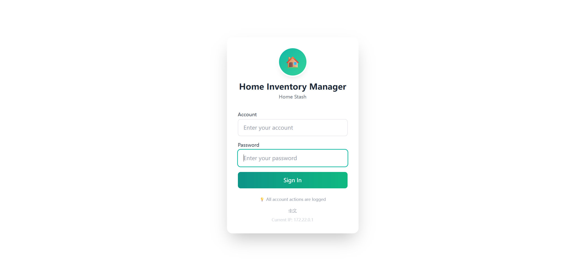
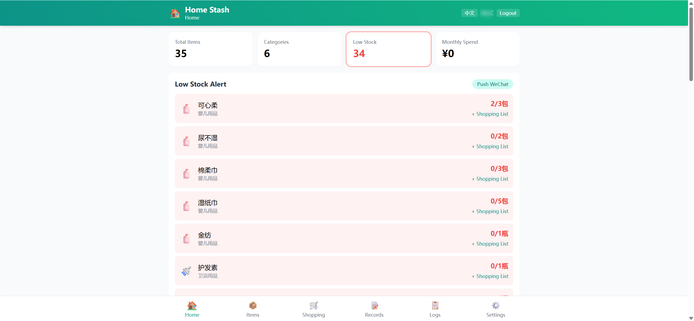
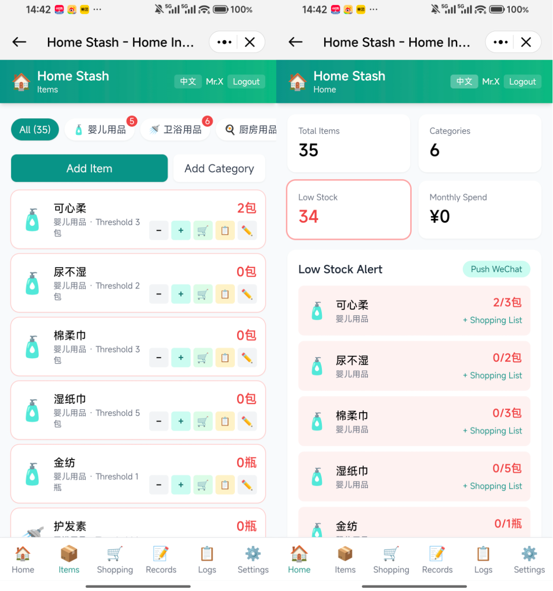

# 🏠 Home Stash

**English** | [简体中文](./README.md)

A lightweight home supplies inventory manager designed for home NAS devices. Supports **multi-user action tracking, WeChat/email auto-notifications, automatic database backups**, with Docker one-click deployment and bare-metal Linux compatibility.

## Preview







## Features

### 📦 Inventory Management
- **6 preset categories** — Baby Care, Bathroom, Kitchen, Household, Food & Drinks, Health — with bilingual (Chinese/English) default templates
- 📊 **Real-time dashboard** — total items, categories, and monthly spend at a glance
- 🔴 **Low-stock highlighting** — red warnings when stock drops below threshold
- ➕➖ **Quick stock adjust** — one-tap stock in/out on mobile, fully logged

### 🛒 Shopping List
- One-click add from low-stock items
- Mark as done/pending — never forget what to buy
- Support custom entries beyond inventory items

### 📝 Purchase Records
- Auto-record time, quantity, unit price, and source on stock-in
- Category-level spending stats to track monthly expenses

### 👥 Multi-User
- Admin + regular user roles
- All actions logged with user identity; IP-bound passwordless login support
- Admin panel for account and system settings management

### 📨 Smart Notifications
- **WeChat push** — daily low-stock check with WeChat notification via OpenClaw
- **Email alerts** — SMTP-based low-stock email notifications (163/QQ/Gmail supported)
- Admin can trigger push/email manually

### 💾 Auto Backup
- Daily scheduled SQLite database backup
- Uses SQLite online backup API — safe and lock-free
- Keeps the last 7 days, auto-cleans older backups

### 🌐 Bilingual UI
- Auto-selects Chinese or English based on browser language
- Manual language toggle with localStorage persistence
- Preset category data follows `APP_LANG` env var for initial setup

### 📱 Responsive
- Mobile / tablet / desktop friendly
- Bottom tab bar navigation optimized for thumbs
- PWA-ready for adding to home screen

## 🚀 Getting Started

### Docker Compose (Recommended)

```bash
git clone https://github.com/SpringShaw/Home-Stash.git
cd home-stash
docker compose up -d --build
```

Visit `http://localhost:8081`

### Bare-Metal Linux

```bash
git clone https://github.com/SpringShaw/Home-Stash.git
cd home-stash

# Install dependencies
pip install fastapi==0.115.0 "uvicorn[standard]==0.32.0" python-multipart==0.0.12 pydantic==2.9.0 bcrypt==4.2.1

# Configure account (before first run)
export ADMIN_ID=admin
export ADMIN_NAME="Your Name"
export ADMIN_PASSWORD=your_password

# Start the service
bash app/start.sh
```

Data is stored under `data/`, `logs/`, `backups/` in the project directory by default. Customize with environment variables:

```bash
export DATA_DIR=/opt/home-stash/data
export LOG_DIR=/opt/home-stash/logs
export BACKUP_DIR=/opt/home-stash/backups
```

### First Login

Configure admin and regular user accounts in `docker-compose.yml`:

```yaml
environment:
  - ADMIN_ID=your_admin_id
  - ADMIN_NAME="Admin Name"
  - ADMIN_PASSWORD=your_admin_password
  - USER_ID=your_user_id
  - USER_NAME="User Name"
  - USER_PASSWORD=your_user_password
```

> ⚠️ If passwords are left blank, the system will **auto-generate random passwords** and print them to container logs (first init only). Be sure to check and save them.

### English Preset Data

To initialize with English category/item names instead of Chinese:

```yaml
environment:
  - APP_LANG=en
```

> Note: `APP_LANG` only takes effect on the **first database initialization**. It does not override data after initialization.

## ⚙️ Configuration

| Variable | Default | Description |
|---------|--------|-------------|
| APP_LANG | zh | Preset data language: `zh` / `en` (first init only) |
| DATA_DIR | ./data | Database storage directory |
| LOG_DIR | ./logs | Log storage directory |
| BACKUP_DIR | ./backups | Backup storage directory |
| ADMIN_ID | (empty) | Admin account ID |
| ADMIN_NAME | 管理员 | Admin display name |
| ADMIN_PASSWORD | (random) | Admin password (auto-generated if blank) |
| USER_ID | (empty) | Regular user account ID |
| USER_NAME | 用户 | Regular user display name |
| USER_PASSWORD | (random) | User password (auto-generated if blank) |
| WECHAT_TARGET | (empty) | WeChat push target ID |
| WECHAT_ACCOUNT | (empty) | OpenClaw WeChat account ID |
| OPENCLAW_GATEWAY | http://127.0.0.1:33970 | OpenClaw Gateway URL (use `http://host.docker.internal:33970` in Docker) |
| NOTIFY_HOUR | 20 | Notification time (hour) |
| NOTIFY_MINUTE | 0 | Notification time (minute) |
| TRUSTED_IPS | (empty) | IP whitelist (comma-separated) |
| TRUSTED_USER | (empty) | Whitelist default login user ID |
| BACKUP_HOUR | 3 | Auto-backup time (hour) |
| BACKUP_MINUTE | 0 | Auto-backup time (minute) |
| COOKIE_SECURE | false | Set to `true` for HTTPS-only cookie (recommended in production) |
| CORS_ORIGINS | * | Allowed CORS origins (comma-separated) |

### WeChat Notifications

1. Deploy OpenClaw Gateway
2. Configure the WeChat bot
3. Set `WECHAT_TARGET` and `WECHAT_ACCOUNT` in `docker-compose.yml`

### Email Notifications

Configure SMTP settings in the admin panel. Works with most email providers (163, QQ, Gmail, etc.). SMTP service and app-specific password must be enabled on the provider side.

## 📁 Project Structure

```
home-stash/
├── app/
│   ├── main.py              # FastAPI app entry (mount routes + startup)
│   ├── database.py          # Database connection, initialization, migrations
│   ├── auth.py              # Auth: bcrypt hashing, sessions, DI
│   ├── models.py            # Pydantic models
│   ├── notifications.py     # Notification service (WeChat + email)
│   ├── scheduler.py         # Scheduled tasks (daily low-stock WeChat push)
│   ├── backup.py            # Auto-backup (daily SQLite backup, 7-day retention)
│   ├── start.sh             # Start script (adaptive: Docker + bare-metal)
│   ├── routes/
│   │   ├── auth.py          # Auth routes (login rate-limited)
│   │   ├── admin.py         # Admin routes (settings/account management)
│   │   ├── categories.py    # Category routes
│   │   ├── items.py         # Item routes (CRUD + stock changes)
│   │   ├── shopping.py      # Shopping list routes
│   │   ├── purchases.py     # Purchase records + stats routes
│   │   ├── logs.py          # Action log routes
│   │   └── notify.py        # Notification routes
│   └── static/              # Frontend (Vue3 + TailwindCSS)
│       ├── index.html       # Main page (bilingual)
│       ├── login.html       # Login page (bilingual)
│       └── lib/             # Frontend dependencies
├── docker-compose.yml
├── Dockerfile
└── deploy.sh
```

## 📡 API Reference

| Method | Path | Description |
|------|------|-------------|
| POST | /api/login | User login |
| POST | /api/logout | User logout |
| GET | /api/me | Get current user |
| GET | /api/trusted-check | Check IP whitelist status |
| GET | /api/categories | List categories |
| POST | /api/categories | Add category |
| DELETE | /api/categories/{id} | Delete category (admin) |
| GET | /api/items | List items |
| POST | /api/items | Add item |
| PUT | /api/items/{id} | Update item |
| DELETE | /api/items/{id} | Delete item (admin) |
| POST | /api/items/{id}/change | Update stock (incl. purchase stock-in) |
| GET | /api/shopping | List shopping list |
| POST | /api/shopping | Add to shopping list |
| PUT | /api/shopping/{id}/done | Mark as purchased |
| DELETE | /api/shopping/{id} | Remove from list |
| GET | /api/purchases | List purchase records |
| GET | /api/stats | Spending stats |
| GET | /api/logs | Action logs |
| POST | /api/notify/check | Trigger low-stock check (admin) |
| GET | /api/admin/settings | Get system settings (admin) |
| POST | /api/admin/settings | Save system settings (admin) |
| GET | /api/admin/accounts | List accounts (admin) |
| POST | /api/admin/accounts | Add/update account (admin) |
| DELETE | /api/admin/accounts/{id} | Delete account (admin) |
| GET | /api/health | Health check |

## 🔧 Maintenance Commands

```bash
# Check container status
docker ps | grep home-stash

# Restart service
docker compose restart

# Stop service
docker compose down

# View live logs
docker logs -f home-stash

# Manual backup
cp data/stash.db backups/stash_$(date +%Y%m%d).db
```

## 🌍 Internationalization

- UI auto-selects Chinese or English based on browser language
- Both main page and login page support bilingual display
- Preset data available in Chinese and English templates (via `APP_LANG` env var)
- Manual language choice persists across sessions

## 📄 License

MIT
