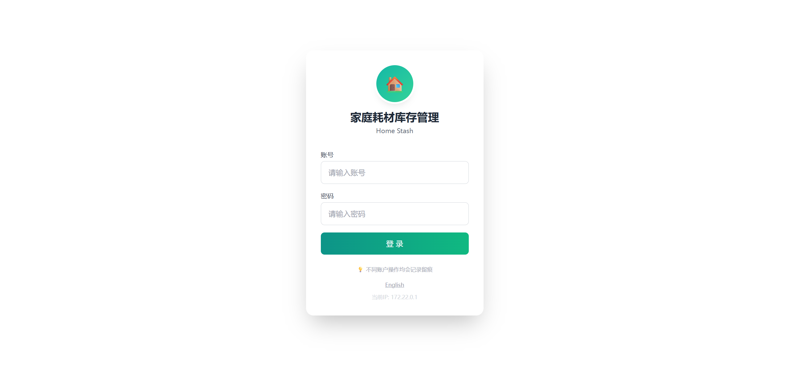
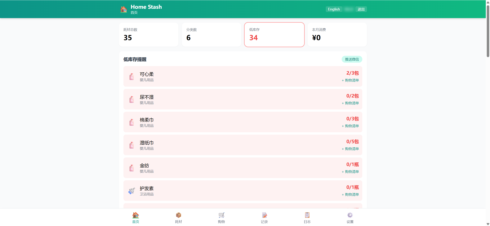
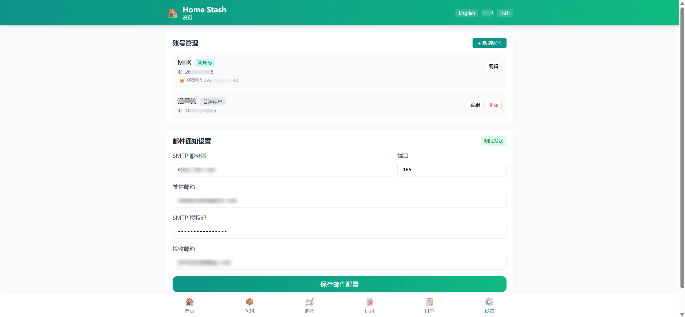
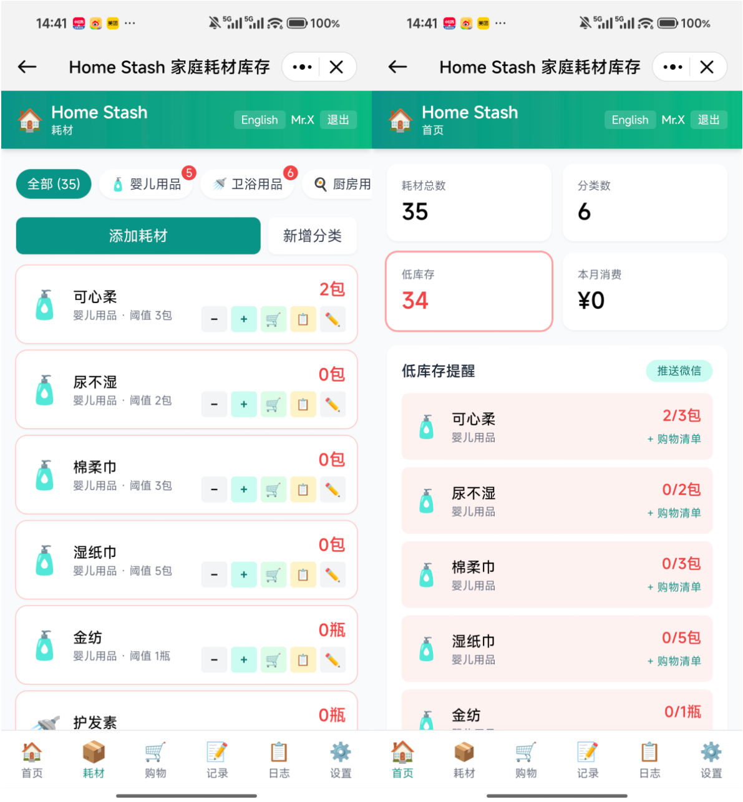

# 🏠 Home Stash

[English](./README.en.md) | **简体中文**

> 一个为家庭 NAS 设计的**轻量耗材库存管理系统**，支持**多用户操作留痕、微信/邮件自动提醒、数据库自动备份**，Docker 一键部署，同时兼容裸机 Linux。

## 界面预览









## 功能特性

### 📦 库存管理
- **6 大预设分类** — 婴儿/卫浴/厨房/日用/食品/医药，支持中英双语默认模板
- 📊 **实时库存看板** — 耗材总数、分类数、本月消费一目了然
- 🔴 **低库存高亮** — 库存低于阈值时红色警告，方便及时补货
- ➕➖ **快捷加减** — 手机端一键增加/减少库存，操作留痕

### 🛒 购物清单
- 一键从低库存添加至购物清单
- 标记已购/待购，出门采购不漏项
- 支持自定义条目（不限耗材库内物品）

### 📝 采购记录
- 采购入库时自动记录时间、数量、单价、来源
- 支持按分类统计消费，了解每月开支去向

### 👥 多用户体系
- 管理员 + 普通用户双角色
- 所有操作记录到人，支持按 IP 绑定免密登录
- 管理员可管理账号、配置系统设置

### 📨 智能提醒
- **微信推送** — 每天定时检查低库存，通过 OpenClaw 推送到微信
- **邮件通知** — 支持 SMTP 配置，低库存邮件提醒（支持 163/QQ 等邮箱）
- 管理员可手动触发推送/邮件

### 💾 自动备份
- 每天凌晨定时备份 SQLite 数据库
- 使用 SQLite 在线备份 API，安全无锁
- 保留最近 7 天，自动清理旧备份

### 🌐 中英双语
- 根据浏览器语言自动选择中文/英文界面
- 支持手动切换语言，localStorage 持久化
- 预设分类数据跟随 `APP_LANG` 环境变量选择语言（首次初始化时生效）

### 📱 响应式设计
- 手机 / 平板 / PC 全适配
- 底部 TabBar 导航，操作顺手
- 支持 PWA 添加至主屏幕

## 🚀 快速开始

### Docker Compose（推荐）

```bash
git clone https://github.com/SpringShaw/Home-Stash.git
cd home-stash
docker compose up -d --build
```

访问 `http://localhost:8081`

### 裸机 Linux 部署

```bash
git clone https://github.com/SpringShaw/Home-Stash.git
cd home-stash

# 安装依赖
pip install fastapi==0.115.0 "uvicorn[standard]==0.32.0" python-multipart==0.0.12 pydantic==2.9.0 bcrypt==4.2.1

# 配置账号（首次运行前）
export ADMIN_ID=admin
export ADMIN_NAME=管理员
export ADMIN_PASSWORD=your_password

# 启动服务
bash app/start.sh
```

数据默认存储在项目目录下的 `data/`、`logs/`、`backups/`，可通过环境变量自定义：

```bash
export DATA_DIR=/opt/home-stash/data
export LOG_DIR=/opt/home-stash/logs
export BACKUP_DIR=/opt/home-stash/backups
```

### 首次登录

在 `docker-compose.yml` 中配置管理员和普通用户的账号信息：

```yaml
environment:
  - ADMIN_ID=你的管理员ID
  - ADMIN_NAME=管理员昵称
  - ADMIN_PASSWORD=管理员密码
  - USER_ID=普通用户ID
  - USER_NAME=用户昵称
  - USER_PASSWORD=用户密码
```

> ⚠️ 如果不设置密码，系统会**自动生成随机密码**并打印到容器日志（仅首次）。请务必在日志中查看并保存。

### 英文预设数据

如果希望默认分类和耗材为英文，在 `docker-compose.yml` 中设置：

```yaml
environment:
  - APP_LANG=en
```

> 注意：`APP_LANG` 仅在数据库首次初始化时生效。已初始化的数据不会因修改此变量而改变。

## ⚙️ 配置说明

| 环境变量 | 默认值 | 说明 |
|---------|--------|------|
| APP_LANG | zh | 预设数据语言，zh/中文 en/英文（仅首次初始化生效） |
| DATA_DIR | ./data | 数据库存储目录 |
| LOG_DIR | ./logs | 日志存储目录 |
| BACKUP_DIR | ./backups | 备份存储目录 |
| ADMIN_ID | (空) | 管理员账号 ID |
| ADMIN_NAME | 管理员 | 管理员昵称 |
| ADMIN_PASSWORD | (随机) | 管理员密码，留空则随机生成 |
| USER_ID | (空) | 普通用户账号 ID |
| USER_NAME | 用户 | 普通用户昵称 |
| USER_PASSWORD | (随机) | 普通用户密码，留空则随机生成 |
| WECHAT_TARGET | (空) | 微信推送目标 ID |
| WECHAT_ACCOUNT | (空) | OpenClaw 微信账号 ID |
| OPENCLAW_GATEWAY | http://127.0.0.1:33970 | OpenClaw Gateway 地址（Docker 中改为 `http://host.docker.internal:33970`） |
| NOTIFY_HOUR | 20 | 提醒时间（小时） |
| NOTIFY_MINUTE | 0 | 提醒时间（分钟） |
| TRUSTED_IPS | (空) | IP 白名单（逗号分隔） |
| TRUSTED_USER | (空) | 白名单默认登录用户 ID |
| BACKUP_HOUR | 3 | 自动备份时间（小时） |
| BACKUP_MINUTE | 0 | 自动备份时间（分钟） |
| COOKIE_SECURE | false | Cookie 是否仅 HTTPS 传输（生产环境建议 true） |
| CORS_ORIGINS | * | CORS 允许来源（逗号分隔） |

### 微信推送配置

1. 部署 OpenClaw Gateway
2. 配置微信机器人
3. 在 `docker-compose.yml` 中填入 `WECHAT_TARGET` 和 `WECHAT_ACCOUNT`

### 邮件通知配置

在系统设置页面配置 SMTP 信息。支持绝大部分邮箱（163、QQ、Gmail 等），需要开启 SMTP 服务并获取授权码。

## 📁 项目结构

```
home-stash/
├── app/
│   ├── main.py              # FastAPI 入口（挂载路由 + 启动）
│   ├── database.py          # 数据库连接、初始化、迁移
│   ├── auth.py              # 认证：bcrypt 密码哈希、会话管理
│   ├── models.py            # Pydantic 数据模型
│   ├── notifications.py     # 通知服务（微信 + 邮件）
│   ├── scheduler.py         # 定时任务（低库存微信推送）
│   ├── backup.py            # 自动备份（每天备份 SQLite，保留 7 天）
│   ├── start.sh             # 启动脚本（自适应 Docker / 裸机）
│   ├── routes/
│   │   ├── auth.py          # 认证路由（含登录速率限制）
│   │   ├── admin.py         # 管理员路由（设置/账号管理）
│   │   ├── categories.py    # 分类路由
│   │   ├── items.py         # 耗材路由（CRUD + 库存变动）
│   │   ├── shopping.py      # 购物清单路由
│   │   ├── purchases.py     # 采购记录 + 消费统计路由
│   │   ├── logs.py          # 操作日志路由
│   │   └── notify.py        # 通知路由
│   └── static/              # 前端（Vue3 + TailwindCSS）
│       ├── index.html       # 主页面（中英双语）
│       ├── login.html       # 登录页面（中英双语）
│       └── lib/             # 前端依赖库
├── docker-compose.yml
├── Dockerfile
└── deploy.sh
```

## 📡 API 接口

| 方法 | 路径 | 说明 |
|------|------|------|
| POST | /api/login | 用户登录 |
| POST | /api/logout | 用户登出 |
| GET | /api/me | 获取当前用户 |
| GET | /api/trusted-check | 检测 IP 是否在白名单 |
| GET | /api/categories | 获取分类列表 |
| POST | /api/categories | 添加分类 |
| DELETE | /api/categories/{id} | 删除分类（管理员） |
| GET | /api/items | 获取耗材列表 |
| POST | /api/items | 添加耗材 |
| PUT | /api/items/{id} | 更新耗材 |
| DELETE | /api/items/{id} | 删除耗材（管理员） |
| POST | /api/items/{id}/change | 更新库存（含采购入库） |
| GET | /api/shopping | 获取购物清单 |
| POST | /api/shopping | 添加购物清单 |
| PUT | /api/shopping/{id}/done | 标记已购 |
| DELETE | /api/shopping/{id} | 删除购物项 |
| GET | /api/purchases | 获取采购记录 |
| GET | /api/stats | 消费统计 |
| GET | /api/logs | 操作日志 |
| POST | /api/notify/check | 手动触发低库存提醒（管理员） |
| GET | /api/admin/settings | 获取系统设置（管理员） |
| POST | /api/admin/settings | 保存系统设置（管理员） |
| GET | /api/admin/accounts | 获取账号列表（管理员） |
| POST | /api/admin/accounts | 新增/修改账号（管理员） |
| DELETE | /api/admin/accounts/{id} | 删除账号（管理员） |
| GET | /api/health | 健康检查 |

## 🔧 常用维护命令

```bash
# 查看容器状态
docker ps | grep home-stash

# 重启服务
docker compose restart

# 停止服务
docker compose down

# 查看实时日志
docker logs -f home-stash

# 备份数据库
cp data/stash.db backups/stash_$(date +%Y%m%d).db
```

## 🌍 多语言支持

- 界面自动根据浏览器语言选择中文/英文
- 登录页和主页面均支持中英双语
- 预设数据支持中/英两套模板（通过 `APP_LANG` 环境变量控制）
- 用户手动切换语言后，选择会持久保存

## 📄 许可证

[MIT License](LICENSE)
